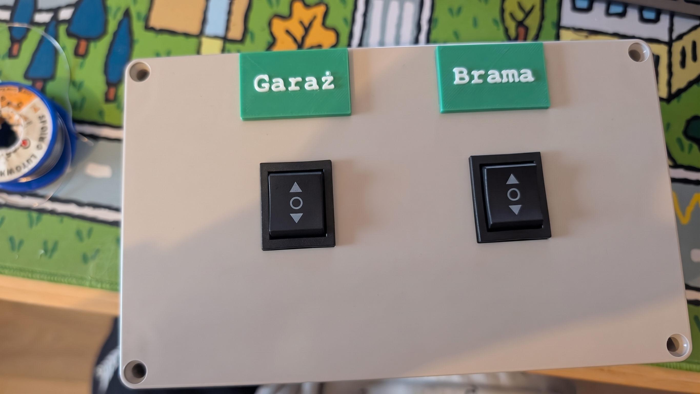
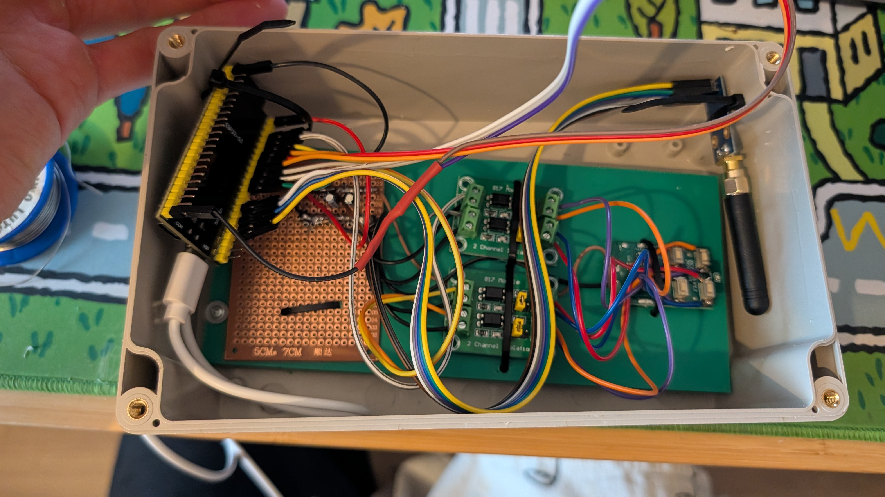

# janus-gate

One wall-mounted box that drives a garage door and a driveway gate, answers to
Home Assistant, and keeps working when the network does not.



It replaces two battery-powered RF remotes and a separate RF bridge. The two
switches on the lid are wired straight to the microcontroller — no Wi-Fi, no
router, no server anywhere in the control path. If the house network is down,
the box still opens the gate.

Built with [ESPHome](https://esphome.io/) on an ESP32-S3. No custom C++
components; everything is YAML and lambdas.

---

## The interesting part

The two drives are controlled by two completely different mechanisms, and the
reason why is the most useful thing in this repository.

### The garage remote is rolling-code, so it is not cloned at all

The garage door's remote could not be cloned. An RF bridge failed on it, it
costs eight times what a fixed-code remote costs, and its PCB is dated 2024 —
all consistent with a rolling code.

So the device does not try. **The original remote lives inside the enclosure**,
battery removed, running off the ESP32's 3.3 V rail. The ESP32 shorts the
remote's own button contacts through optocouplers — electrically identical to a
finger press.

The drive therefore sees a remote it was already paired with. No protocol was
reverse-engineered and no gate security was bypassed or weakened. The remote
does its own rolling-code work; the microcontroller just presses its buttons.

### The gate remote is learned on the device, not in firmware

The gate's remote lives at the gate, 30 km from the workbench, and was never
available during the build. Rather than make two trips, the firmware grew a
**learn mode you drive from a phone** over the ESP's own access point.

A CC1101 433 MHz transceiver captures the remote's raw OOK waveform on site,
stores it in NVS, and replays it. Nothing is baked into firmware, so the device
can be re-taught, moved to a different gate, or taught an extra remote without
reflashing.

Codes are stored as **raw pulse timings**, not as a decoded protocol. Decoded
storage would be far smaller, but it only works when a built-in decoder
recognises the encoding — and learning happens on site with no chance to debug.
Universality beat elegance.

---

## Inside



Left: the ESP32-S3 DevKitC-1 on perfboard. Centre: two PC817 two-channel
optocoupler modules, four channels driving the garage remote's four buttons.
Right: the CC1101 with its SMA antenna. Single USB-C supply for everything.

### Bill of materials

| Item | Notes |
|---|---|
| ESP32-S3 DevKitC-1 WROOM-1 N16R8 | 16 MB flash, 8 MB octal PSRAM (unused) |
| 2 × PC817 2-channel optocoupler module | 4 channels used |
| CC1101 433 MHz — Ebyte E07-M1101D-SMA | with SMA antenna |
| 2 × ON-OFF-ON momentary toggle, DPDT | one pole wired each |
| 1 × garage remote, 3 V | sacrificed to the cause, lives inside the box |
| 100 nF + 47 µF × 2 | decoupling at the remote and at the radio |
| Perfboard 5 × 7 cm, 3D-printed enclosure | |

---

## Wiring

### Garage — optocouplers

| Function | GPIO | Module | Channel |
|---|---|---|---|
| Stop | 4 | Opto 1 | 2 |
| Open | 5 | Opto 1 | 1 |
| Close | 6 | Opto 2 | 1 |
| Lock | 7 | Opto 2 | 2 |

GPIO → IN+, GND → IN−. The transistor side goes across the remote's button
pads: collector to the pad at the higher potential, emitter to the lower. **The
transistor side needs no ground connection** — it shorts two contacts and has
no idea what potential they sit at.

### CC1101 — Ebyte E07-M1101D-SMA

| Pin | Signal | ESP32-S3 |
|---|---|---|
| 1 | GND | GND |
| 2 | VCC | 3.3 V |
| 3 | GDO0 | GPIO 9 — transmit |
| 4 | CSN | GPIO 10 |
| 5 | SCK | GPIO 12 |
| 6 | MOSI | GPIO 11 |
| 7 | MISO | GPIO 13 |
| 8 | GDO2 | GPIO 8 — receive |

**This pinout is not the generic one.** See the traps below before wiring.

### Physical switches

Garage up/down on GPIO 15/16, gate up/down on GPIO 17/18. Common to GND,
internal pullups, no external resistors.

### Power

Single USB-C into the DevKit. The remote and the CC1101 each take their own
branch from the DevKit's 3V3 pin — star, not daisy chain — because the remote
is an analogue RF transmitter and the radio draws current in spikes while
transmitting. Chained on one wire run, each would modulate the other's supply.

Pins to leave alone: 26–32 flash, **33–37 octal PSRAM** (specific to the N16R8),
0/3/45/46 strapping, 19/20 USB-JTAG, 43/44 UART0, 38 or 48 RGB LED.

---

## Getting started

```bash
git clone https://github.com/michal3toja7/janus-gate
cd janus-gate
cp secrets.sample.yaml secrets.yaml
# fill in all seven values; api_key needs: openssl rand -base64 32
pip install esphome
esphome run janus-gate.yaml
```

The first flash must go over USB, through the **UART port** on the DevKitC-1 —
not the native USB port. Every flash after that can go over the air.

> **Before every flash, disconnect the remote from the optocouplers.** GPIO
> states are undefined during boot and you can fire the garage by accident.

Once running, the device is reachable at `janus-gate.local` over the native
ESPHome integration in Home Assistant, or through its own web panel.

### Repo layout

```
janus-gate.yaml          production entry: identity, tuning knobs, package map
janus-gate-debug.yaml    diagnostic entry: opens up the receiver for sniffing
packages/
  core.yaml              board, connectivity, flashing
  radio.yaml             SPI, CC1101, transmitter
  garage.yaml            optocoupler path, end to end
  gate.yaml              CC1101 replay path, end to end
  learning.yaml          receiver + capture logic; owns the learned codes
  diagnostics.yaml       device-level sensors and the state reset
  debug.yaml             radio sniffing aids, debug builds only
Handoff.md               full project state, every trap, outstanding work
```

Each drive's file reads top to bottom as one complete control path — outputs,
scripts, buttons, switch, assumed state — so you can understand one drive
without reading anything else.

### Teaching it a gate remote

Press "Learn gate open" in the web panel, then **hold** the matching button on
the original remote near the antenna. Two matching frames are required, so a
tap may not be enough. Watch the pulse count: around 50 is a healthy fixed-code
frame, 2 or 4 means you captured noise.

Full procedure in [Handoff.md](Handoff.md).

---

## The traps

Every project has these. Almost nobody writes them down, which is why this
section exists — it is more useful than the architecture.

A thread runs through most of them: **an indicator tells you about what it
measures, not about what you want to know.**

### An LED reported the wrong thing for weeks

The remote's positive battery tab had **two electrically separate pads**. One
feeds the encoder and the status LED. The other feeds the RF output stage.
Only one was soldered.

The remote looked perfect. Buttons responded. The LED lit on every press.
Voltage measured a steady 3.2 V. It transmitted nothing at all, and had
transmitted nothing since the day it was wired in. This was found after driving
60 km to the gate, finding nothing worked, and reasoning backwards.

The LED was never lying. It honestly reported that the encoder had power. It
was read as "the remote is transmitting."

### The radio does not switch itself into transmit mode

ESPHome's `remote_transmitter` will generate perfect timings on the data pin
while the CC1101 sits in receive mode. The action fires, the logs are clean,
the stored code is valid, and nothing reaches the air.

The two components have no coupling at all. The radio's state machine moves
only on explicit actions:

```yaml
- cc1101.begin_tx: radio
- remote_transmitter.transmit_raw: { ... }
- cc1101.begin_rx: radio
```

`begin_rx` matters as much as `begin_tx` — without it the radio stays in
transmit and never receives again, so learning silently stops working after the
first send. This also needs `non_blocking: false` on the transmitter: since
ESPHome 2025.11.0 that defaults to `true`, and a queued transmission would let
`begin_rx` yank the chip out of TX midway through the frame.

### Fighting noise at the radio layer killed reception — twice

Trying to quiet the noise floor, the channel filter was narrowed to 58 kHz and
the pulse filter raised to 250 µs. **Reception stopped completely, both times.**

Cheap remotes use SAW resonators that drift hundreds of kHz off nominal, so a
narrow window simply misses them. And the remote's short pulses measured
275–300 µs — below a 250 µs filter once jitter is counted. Every bit was being
discarded as a spike.

The correct answer was not to filter at the radio layer at all. Let the
receiver hear everything and reject noise in software, by requiring two
matching frames before storing a code. Noise does not repeat; remotes do.

### A build system that reports success and produces nothing

On Windows, running `esphome compile` from a Git Bash / MSys shell deletes the
build directory, builds nothing, and exits 0 with
`INFO Successfully compiled program.` The same command in PowerShell produces a
full build. Both print the success line.

Build from PowerShell or your IDE, and check that the binary actually appeared
rather than trusting the exit code.

### The Ebyte module's pinout is not the generic one

Generic CC1101 breakouts put GDO2 on pin 7 and MISO on pin 8. The Ebyte
E07-M1101D has them **the other way round**. Wiring from a generic diagram
gives a dead SPI bus and no clue why.

Reliable way to orient the header: pin 1 is GND and has continuity with the SMA
connector shell. Beep from the shell to each pin.

### Optocoupler module jumpers must be removed

The per-channel jumpers on these PC817 boards select trigger polarity. Left
fitted, the channel conducts permanently, which holds a remote button down and
locks up the remote's encoder — making *every* button stop working. The remote
looks broken. Nothing on the board says so.

### A toggle lever pivots

Pushing the lever up closes the contact on the *lower* side of the switch body.
Assign GPIOs by lever position as the user experiences it, then fix the
inversion in the wiring rather than the config.

**The full list, including several that only matter once you are deep in, is in
[Handoff.md](Handoff.md#7-the-traps).**

---

## Design notes

**Anti-reverse.** The garage drive reverses instantly on the opposite command,
which is hard on the motor under load and almost never what the user meant. The
device tracks assumed direction and substitutes a Stop.

That state is an assumption, never a measurement — there is no feedback from
either drive, and it drifts if someone uses the original remote. It was
accepted deliberately because the failure modes are asymmetric: a stale
"moving" state costs one wasted press, since Stop on a stationary door does
nothing, and a stale "idle" state behaves exactly as if the feature did not
exist. Neither is worse than not having it. That asymmetry is the test worth
applying to any unverifiable shortcut.

**Primitives separated from logic.** `send_garage_open` pulses an optocoupler.
`cmd_garage_open` carries the direction logic and calls it. The split avoids
recursion and keeps raw actions reachable for debugging — exposed as `(direct)`
buttons that bypass the state machine entirely. They earned their place
repeatedly.

**A debug build.** `janus-gate-debug.yaml` reuses every package unchanged and
overrides only the receiver: pulse filter dropped to 10 µs and raw frame
dumping on. It adds buttons that retune the radio between 433.92 and 433.42 MHz
at runtime, because hearing nothing proves nothing unless the radio is
listening where the remote actually talks.

---

## Status

Working and installed. Both drives operate from the physical switches and from
Home Assistant. Learning captures real frames and rejects noise, and a learned
code has been replayed to a test receiver successfully.

Not yet verified: NVS persistence across a real power cut, whether the learned
code opens the actual gate, and the measured gate travel time. Stage 7 — an
RFID reader on the reserved pins — is not started.

Honest detail on all of it in [Handoff.md](Handoff.md#11-verified-vs-not).

## Security

Stated plainly, because a gate opener deserves it.

The web panel has HTTP basic auth, but this ESP32 does no TLS, so credentials
cross the network in clear text. That deters casual access on a trusted LAN; it
is not protection against someone already inside it.

The larger exposure is the fallback access point, which is visible from outside
the building whenever the main Wi-Fi is unreachable. Make `fallback_password`
long and random.

And the physical switches authenticate nobody. That is intentional and is the
entire point of the device — but it means security ultimately reduces to who
can reach the box on the wall.

No gate security was bypassed in building this. The garage path presses an
already-paired remote's buttons; the gate path replays a code captured from a
remote its owner holds.

## A warning, if you build one

This drives motors that can trap a person or a car, and "Lock" on most drives
can leave you unable to open your own garage from anywhere. Understand your
drive's behaviour before wiring anything to it, keep a working original remote,
and do not let the software's assumed state be the only thing standing between
a moving door and something underneath it.

## License

[MIT](LICENSE). Use it, change it, sell it — just keep the copyright notice.

Note what that covers and what it does not: the licence grants rights to the
software. It does not vouch for the hardware, and the warranty disclaimer is
not a formality on a project that drives motors. Read the warning above.
